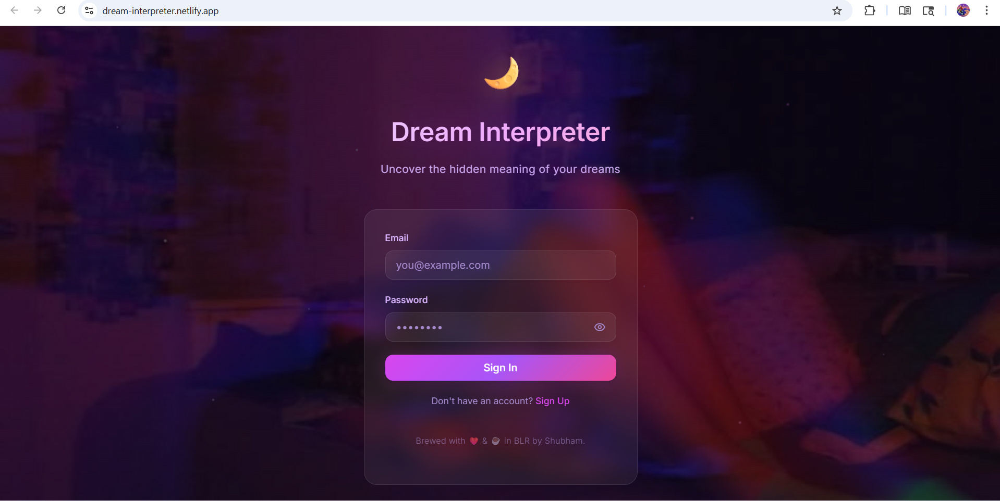

# 🌙 Dream Interpreter V2 ✨

An AI-powered celestial journal designed to translate the whispers of your subconscious. Experience a premium, mystical interface while gaining deep insights into your dreams, symbols, and emotional atmosphere.



## 🌖 Core Features

-   **✨ AI-Driven Interpretation**: Leverages high-level AI (Google Gemini) to decode themes, emotional tones, and symbolic meanings in your dreams.
-   **📔 Celestial Journaling**: A private history of your subconscious journey with premium dark-mode aesthetics, fluid animations, and sentiment-based color-coded glows.
-   **📊 Analytics Dashboard & Sentiment Tracking**: Visualize your emotional journey with interactive charts driven by Recharts.
-   **🛡️ Secure & Private**: Built on Supabase with robust Row Level Security (RLS). Soft-deletion ensures data safety, while Admin privileges restrict access to global dream logs.
-   **🌓 Shared Visions**: Generate encrypted share links to pass your interpretations to others without compromising your entire journal.

## 🛠️ Technology Stack

-   **Frontend**: React 18, Vite, TypeScript, React Router, Lucide Icons, Recharts.
-   **Styling**: Vanilla CSS (Custom Celestial Design System).
-   **Backend**: Netlify Serverless Functions.
-   **Database & Auth**: Supabase (PostgreSQL with GIN Indexing for fast search).
-   **AI Engine**: Google Gemini API.

## ⚙️ Quick Setup

### 1. Requirements
-   Node.js (v18+)
-   Supabase Account
-   Netlify Account (for deployment)
-   Gemini API Key

### 2. Local Configuration
Create a `.env` file in the root directory:

```env
VITE_SUPABASE_URL=your_supabase_url
VITE_SUPABASE_ANON_KEY=your_anon_key
VITE_ADMIN_EMAIL=your_admin_email@example.com
```

Create a `.env` file in the `netlify/functions` directory (or use Netlify dashboard):
```env
GEMINI_API_KEY=your_gemini_api_key
```

### 3. Database Initialization
Run the contents of [supabase-setup.sql](./supabase-setup.sql) in your Supabase SQL Editor to initialize the `dreams` table, RLS security policies, and GIN indices.

### 4. Installation
```bash
npm install
npm run dev
```

## 🚀 Deployment

This project is optimized for **Netlify**.

1.  Push your repository to GitHub.
2.  Connect the repository to Netlify.
3.  Add the environment variables listed above to your Netlify dashboard.
4.  Standard builds use `npm run build` and publish the `dist` folder.

---

*Brewed with ❤️ & ☕ in BLR by Shubham.*
